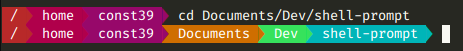

# shell-prompt



Custom Linux shell prompt written in C++.

## Features

- Display the current working directory
- Customizable color gradients for text and background
- Can use TrueColors or 256-Colors for older terminals
- Configuration set in separate config file
	
### TODO
- Customizable prompt size for long paths
- Customizable directory name length
- Wrap `/home/<user>` in `~`
	
## Install
- Clone this repository
- Compile the sources using `make`
- In `prompt.sh`, replace the path to the configuration file with yours 
```
export PS1=`shell_prompt ~/.local/bin/settings.conf`
```

- **Optional -** Copy the binary file `shell_prompt`, the start script `prompt.sh` and the config file `settings.conf` in whatever directory you want
- Place this line at the bottom of your `.bashrc` file - don't forget to put the path to the `prompt.sh` file:
```
PROMPT_COMMAND=". path/to/prompt.sh"
```

## Configure

You can comment a line by putting '#' at the start of a line, so the line will not be parsed by the program.

All colors must be hexadecimal color codes.

The program will absolutly look for `background`, `foreground` and `truecolors` settings.
If one of these keys is not found in the file, it will crash.
You can put multiple lines with the same key but only the first one will be read.

### Background gradient

This gradient is used as the background color for each directory "arrow" in the path. 
You can put as many colors as you want in this array. 
If the path is longer than the number of colors in the array, it will loop back to the first color.
```
background=["#b82929",  "#b0004b", "#97086a", "#cf6e00", "#36e25c", "#00b5b8","#247ba5","#48437a","#4c0031","#860136","#b82929"]
```

If you want only one color you can put it in an array or not.
```
background=["#b82929"]
# or
background="#b82929"
```

### Foreground gradient

This gradient is used as the text color for each directory in the path. 
You can put as many colors as you want in this array. 
If the path is longer than the number of colors in the array, it will loop back to the first color.
```
foreground=["#FFFFFF"]
```

If you want only one color you can put it in an array or not.
```
foreground=["#FFFFFF"]
# or
foreground="#FFFFFF"
```

### Color encoding

This sets the color encoding used by the program to indicate the terminal which color to print.
```
truecolor=true
```

- `truecolor=true` will set the TrueColors encoding, which uses 24 bits to code the color. This is the standard encoding used by modern terminals. It allows a wide range of colors but can be unsupported by old terminals.  
- `truecolor=false` will set the 256-Colors encoding, which uses 8 bits to code the color. It allows a narrower range of colors but is supported by nearly every terminal.  


## Disable / Uninstall
- Remove the following line from your `.bashrc` file to disable the custom prompt
```
PROMPT_COMMAND=". path/to/prompt.sh"
```
- Delete the binary file `shell_prompt`, the start script `prompt.sh` and the config file `settings.conf` from whatever directory you put them into to completly uninstall the program

## Licence

Licensed under the MIT License.

**Created by const39.**
